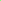
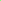
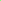
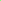

# How To Build Network Usage Dashboard

**How To Build Network Usage Dashboard** is a HarmonyOS wearable codelab that demonstrates real-time network data monitoring on standalone cellular watches. It shows per-interface and per-app traffic consumption, enforces daily data limits with configurable quota policies, checks TLS certificate trust for network connections, and discovers nearby local services over mDNS — all in a compact circular-screen dashboard layout.

# Preview

<div align="center">
  
  
  
  
</div>

# Use Cases

- **Real-time usage tracking:** View live Wi-Fi and cellular byte counts per network interface, updated every 30 seconds via `statistics.getIfaceRxBytes` and `statistics.getIfaceTxBytes`.
- **Daily quota enforcement:** Set a daily data limit in MB; the app fires a system notification when usage reaches the threshold using `notificationManager.publish`.
- **Certificate and cleartext policy inspection:** Check TLS connectivity and cleartext-traffic permissions for a host using `networkSecurity.isCleartextPermitted` and an HTTPS HEAD request.
- **mDNS service discovery:** Browse `_http._tcp` and `_https._tcp` services on the local network using `mdns.createDiscoveryService` and `mdns.resolveLocalService`.
- **Historical data review:** Scroll through a 7-day bar-chart history of daily usage summaries stored in device preferences.

# Technology

## Stack

- **Languages**: ArkTS, ArkUI
- **Frameworks**: HarmonyOS SDK 6.0.1
- **Tools**: DevEco Studio NEXT
- **Libraries**:
  - `@kit.NetworkKit` — statistics, connection, networkSecurity, mdns
  - `@kit.NotificationKit` — system alert notifications
  - `@kit.ArkData` — preferences-based persistent storage

## Required Permissions

- `ohos.permission.GET_NETWORK_INFO`
  > Required to query the default network handle and its capabilities (bearer type, metered status, bandwidth).

- `ohos.permission.INTERNET`
  > Required for the TLS certificate check that performs an HTTPS HEAD request to verify connectivity.

- `ohos.permission.MANAGE_NET_STRATEGY`
  > Required to read per-interface and per-UID traffic statistics via the `statistics` module.

# Directory Structure

```text
entry/src/main/ets/
├── components/
│   ├── AlertBannerComponent.ets     # Full-width limit-exceeded banner
│   ├── InterfaceRowComponent.ets    # Per-interface RX/TX tile row
│   ├── MetricTileComponent.ets      # Compact label + value chip
│   └── UsageRingComponent.ets       # Circular usage progress ring
├── entryability/
│   └── EntryAbility.ets
├── entrybackupability/
│   └── EntryBackupAbility.ets
├── models/
│   ├── NetworkModel.ets             # UsageSnapshot, InterfaceUsageRecord, AppUsageRecord, DailyUsageSummary
│   └── SettingsModel.ets            # dailyLimitMB, refreshIntervalSec, notificationsEnabled
├── pages/
│   ├── Index.ets                    # ArcSwiper entry shell
│   ├── DashboardScreen.ets          # Usage ring + Wi-Fi / mobile tiles
│   ├── DetailPage.ets               # Per-interface stats list
│   ├── HistoryPage.ets              # 7-day usage bar chart
│   ├── PolicyPage.ets               # Bearer type, metered status, bandwidth
│   ├── SecurityPage.ets             # TLS status + cleartext policy
│   ├── ServicesPage.ets             # mDNS service discovery browser
│   └── SettingsPage.ets             # Daily limit, notifications, history reset
├── services/
│   ├── AlertService.ets             # Quota alert — fires once per day
│   ├── NetworkMonitorService.ets    # 30-second polling, statistics API wrapper
│   └── StorageService.ets           # Preferences read/write for history and settings
└── utils/
    ├── BasicDataSource.ets          # IDataSource implementation for LazyForEach
    └── NetworkUtils.ets             # bytesToMB, isWifi, todayDateString, formattedTime
```

# Constraints and Restrictions

## Supported Devices

- Huawei Watch 5
- DevEco Studio Simulator

# License

**How To Build Network Usage Dashboard** is distributed under the terms of the MIT License.
See the [LICENSE](/LICENSE) for more information.
